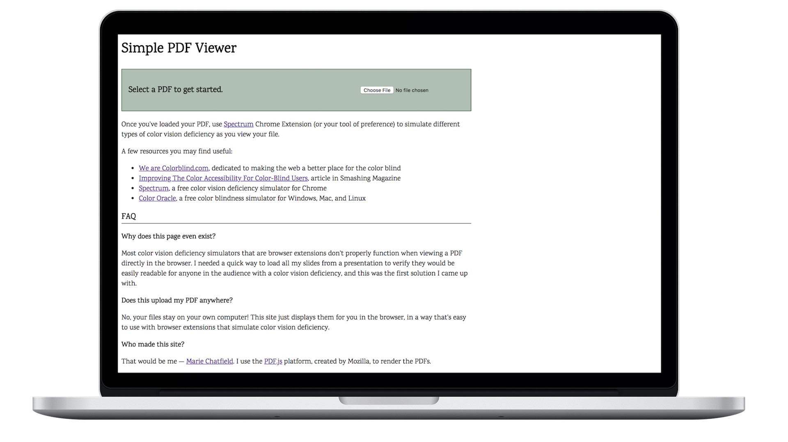

  

{: .content__section__image }
  

  

#### [CallMyCongress.com](https://www.callmycongress.com)
##### November 2016

__Quick and easy access to your congressional representatives.__

Look up your US Congress representatives and senators, using your street address and zip code.
Call or tweet at your representatives with two clicks.
Check voting records and ensure your legislators are representing your interests.
Permalink to your district for easy access.

Built on data freely provided by the [US Census Geocoding Services](https://geocoding.geo.census.gov/) and [ProPublica](https://www.propublica.org/datastore/apis).

Consists of an Ember client side app and a tiny Express backend server. [See the source code and contribute.](https://github.com/mariechatfield/call-my-congress)

  

  

{: .content__section__image }
  

  

#### [Color Vision Deficiency PDF Viewer](http://mariechatfield.com/simple-pdf-viewer)
##### March 2018

__Preview PDFs in the browser with eight different variations of color vision deficiency.__

View each page of a PDF with filters that simulate eight different types of color vision deficiency to verify that your content is accessible for color blind people.

Includes recommended resources for further reading and for color vision deficiency simulator software.

Uses the [PDF.js](https://mozilla.github.io/pdf.js/) platform (created by Mozilla) and the color blind SVG filters found in the [colourblind](https://github.com/Altreus/colourblind) bookmarklet (created by [Alastair Douglas](https://github.com/Altreus)). [See the source code and contribute.](https://github.com/mariechatfield/simple-pdf-viewer)

  

  

{: .content__section__image }
  

  

#### [Markomposition](http://mariechatfield.com/markomposition)
##### March 2015

__A Markov Chain poetry generator.__

Generates poetry using variable order Markov chains. Uses the
[Irvine Phonotactic Online Dictionary](http://www.iphod.com/) to determine
proper syllable count for forms which rely on strict meter.

Written in Javascript, originally adapted from introductory coursework written in Python.

Includes short descriptions of different poetic forms, as well as a basic explanation of Markov chains,
to encourage further exploration of these topics.
  

  

{: .content__section__image }
  

  

#### [one.two.tree](http://mariechatfield.com/onetwotree)
##### December 2014

__A browser-based math and logic puzzle game.__

Object-oriented design with multiple layers of abstraction and a clean MVC architecture written in Javascript.

Game board user-interface comprises Bootstrap components exclusively for complete responsiveness.
Pieces are re-sized depending on both window size and size of current game board to waste minimum space and improve usability.

Randomly generates puzzle congfigurations at runtime and can accept multiple solutions.
Features three different levels of difficulty and a timer setting.
  

